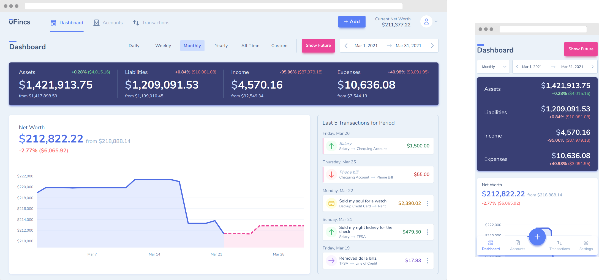

<br>

<p align="center">

</p>

<h1 align="center">Dapp Lab</h1>

<p align="center">Ethereum Contract Dapp
</p>

<p align="center">
    <a href="https://www.npmjs.com/package/smarty-admin-ui"></a>
    <a href="https://github.com/smarty-team/smarty-admin/actions/workflows/main.yml"></a>
</p>

Ethernet Smart Contracts and DApp Development Framework and Engineering，based on [React](http://reactjs.org/) + [Next.js](https://nextjs.org/) + [Material UI](https://material-ui.com/).

This project demonstrates a basic Hardhat use case. It comes with a sample contract, a test for that contract, and a script that deploys that contract.

The buzzwordy way to describe Dapp Lab is as a "privacy-first, encrypted personal finance app". Try out the free "no-account" mode to get a feel for the complete experience without having to sign up. Or, jump straight into the [user docs](docs/user/README.md) to learn how to host Dapp Lab yourself (or how to build it as a [native app](docs/user/README.md#native-app-without-backend)).
  
## Table of Contents

- [Table of Contents](#table-of-contents)
- [About Dapp Lab](#about-dapp-lab)
  - [Security](#security)
- [Repo Structure](#repo-structure)
  - [Tech Stack](#tech-stack)
- [Getting started](#getting-started)
- [Recommended VS Code extensions](#recommended-vs-code-extensions)
- [Other commands](#other-commands)
  - [Lint commands](#lint-commands)
  - [Build commands](#build-commands)
  - [Run the app in production mode at http://localhost:3000.](#run-the-app-in-production-mode-at-httplocalhost3000)
  - [Test commands](#test-commands)
- [Compatibility](#compatibility)
- [Contributors](#contributors)
- [Roadmap](#roadmap)
- [License](#license)

## About Dapp Lab

<div align="center">
  
</div>

For the more technically minded, Dapp Lab is a personal finance app with the following characteristics:

- **It's a web app**
  - Specifically, it's an offline-first PWA. That means that once you're logged-in, you can use the app without an internet connection. Heck, you can even use the app without an account!
- **But also a 'native' app**
  - We use [Capacitor](https://capacitorjs.com/) to wrap the Dapp Lab PWA into Android, iOS, and Electron apps (but you have to compile them yourself). Combined with Dapp Lab' no-account mode, that means you can run Dapp Lab completely standalone, without having to deal with setting up the backend API or database.
- **It encrypts your data**
  - All data is encrypted in-browser (or in-app) before it is sent off to be persisted in the backend database. This provides a layer of security that few other apps can boast.
- **It forces you to enter transactions manually**
  - You won't find any bank syncing here like other finance apps do. Nope, Dapp Lab is built on the principal of tirelessly tracking each and every penny — _by hand_.
- **But it does support CSV import...**
  - This is one of the concessions to the 'manual tracking'. Grab a CSV of your transactions from your bank and you can import them directly into the app.
- **... and recurring transactions**
  - OK, we're not completely heartless about the 'enter everything manually' goal. Recurring transactions certainly help cut down on some of that work.
- **It also kinda allows custom integrations**
  - What? You _really_ want bank syncing? Fine, check out the [api-proxy-prototype](https://github.com/Dapp Lab/api-proxy-prototype) to learn how you can build your own custom bank syncing integration. Just know that it'll never be supported as a first-class feature :)
- **It supports precisely one currency**
  - You can change which currency symbol is displayed throughout the app, but there is no multi-currency support in Dapp Lab.

What does Dapp Lab _not_ do (and likely will never do)?

- **Bank syncing**
  - This was addressed above.
- **Multiple currencies**
  - Also addressed above.
- **Budgeting**
  - Double-entry accounting or bust.
- **Track stock prices**
  - ... or do any other kind of 'external' integration for that matter. Dapp Lab is a self-contained system; if you want custom external integrations, you can build them yourself (using, for example, the [api-proxy-prototype](https://github.com/Dapp Lab/api-proxy-prototype) as a base).

### Security

Want to learn more about the security aspects of Dapp Lab? Check out the [security guide](https://Dapp Lab.com/policies/security) on the marketing site.


## Repo Structure

Want to just poke around? Here's a quick overview of the repo structure. Most sub-folders have their own README for more in-depth explanations.

```
├── cloudbuild.yaml   # Cloud Build (CI/CD) pipeline for production GCP infrastructure
├── docs/             # Misc repo-level documents/images
├── helm/             # Helm templates used to generate the Kubernetes manifests (using Kubails)
├── kubails.json      # Kubails configuration file
├── Makefile          # Makefile that contains the primary commands for controlling the repo
├── manifests/        # Where the Kubernetes manifests are stored/generated to
├── scripts/          # Misc scripts that enable operation of the repo
├── services/         # All of the actual application code, divided up into Kubails services
├── terraform/        # Terraform config for the production GCP infrastructure (used by Kubails)
└── terraform-aws/    # Terraform config for the production AWS infrastructure (for database backups)
```

### Tech Stack

- **Infrastructure Framework:** [Kubails](https://github.com/DevinSit/kubails)
- **Production Infrastructure:** Kubernetes (GKE) on Google Cloud Platform (GCP), with Cloud Build for CI/CD
- **Frontend:**
  - **Language:** TypeScript
  - **Framework:** React + Redux + redux-saga, create-react-app
  - **Styling:** Plain old Sass
  - **Testing:** Jest, Cypress, Storybook
  - **Linting:** ESLint, Prettier
  - **Native Apps:** Capacitor
- **Backend:**
  - **Language:** TypeScript/Node
  - **API Framework:** Feathers.js + Express
  - **ORM:** Sequelize (backed by Postgres)
- **Marketing site:**
  - **Language:** Plain JavaScript
  - **Framework:** React, NextJS
  - **Styling:** Tailwind CSS + Sass
- **Database:** Postgres


## Getting started

1. Create the project.

   ```bash
   npx degit fabien-ml/react-ts-vite-template my-app
   ```

2. Access the project directory.

   ```bash
   cd my-app
   ```

3. Initialize a git repository.

   ```bash
   git init
   ```

4. Install dependencies.

   ```bash
   npm install
   ```

5. Start dev server with hot reload at http://localhost:3000.
   ```bash
   npm run dev
   ```

## Recommended VS Code extensions

- [ESLint](https://marketplace.visualstudio.com/items?itemName=dbaeumer.vscode-eslint)
- [Prettier](https://marketplace.visualstudio.com/items?itemName=esbenp.prettier-vscode)

## Other commands


Try running some of the following tasks:

```shell
npx hardhat help
npx hardhat test
REPORT_GAS=true npx hardhat test
npx hardhat node
npx hardhat run scripts/deploy.ts
```

### Lint commands

```bash
npm run lint
```

### Build commands

```bash
npm run build
```

### Run the app in production mode at http://localhost:3000.

```bash
npx hardhat node
npx hardhat run scripts/deploy.ts
```

### Test commands

- Run unit tests and watch
  ```bash
  npx hardhat test
  REPORT_GAS=true npx hardhat test
  ```
- Run unit tests with coverage
  ```bash
  npm run test:unit:coverage
  ```
- Run e2e tests
  ```bash
  npm run test:e2e
  ```


## Compatibility

Compatible for most modern browsers.

You should import [babel-polyfill](https://cdn.baomitu.com/babel-polyfill) for early browers(i.e. iOS 8).

Node.js 8.x 以上
Chrome
有良好命令行支持的系统


## Contributors

Like any other good open source project, Dapp Lab is open to contributions. Just make sure to follow the rules and guidelines in the [CONTRIBUTING](CONTRIBUTING.md) file. Thanks goes to these wonderful people ([emoji key](https://allcontributors.org/docs/en/emoji-key)):

<!-- ALL-CONTRIBUTORS-LIST:START - Do not remove or modify this section -->
<!-- prettier-ignore -->

|                                                                                                                                                                                                                                                                                                                   |       |       |       |       |       |       |
| :---------------------------------------------------------------------------------------------------------------------------------------------------------------------------------------------------------------------------------------------------------------------------------------------------------------: | :---: | :---: | :---: | :---: | :---: | :---: |
| [<br /><sub><b>betseyliu</b></sub>](https://github.com/betseyliu)<br />[💻](https://github.com/Smarty/Smarty/commits?author=betseyliu "Code") [📖](https://github.com/Smarty/Smarty/commits?author=betseyliu "Documentation") |

## Roadmap

Frankly, Dapp Lab has met and exceeded my own expectations and use cases. As such, it does not have an active roadmap — I just work on what I want when I feel like it.

## License

This project is licensed under the MIT License — see the [LICENSE](LICENSE.md) file for details.


